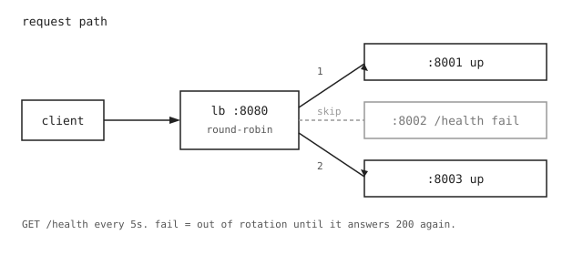

# HTTP Load Balancer

Go reverse proxy. One listen port, a list of backends, round-robin between
the ones that are up. A loop hits `GET /health`; a non-200 takes that
server out until it comes back.



```
client --> :8080 --> :8001
                 --> :8002  (down, skipped)
                 --> :8003
```

## Run

Three terminals for the dummy servers:

```
go run ./demo -name a -port 8001
go run ./demo -name b -port 8002
go run ./demo -name c -port 8003
```

Then:

```
go run ./cmd/lb -config configs/config.yaml
curl localhost:8080
```

You should see `a`, `b`, `c` in order. Kill one demo process. The next
curls should miss that name. Start it again and it shows back up after
the next health check (5s).

```
go test ./...
```

## Layout

```
cmd/lb              listen + proxy + health loop
internal/backend    one server + its reverse proxy
internal/pool       next healthy backend
demo                tiny HTTP servers for local testing
configs/config.yaml listen, backends, health path/interval
docs/flow.svg
```
